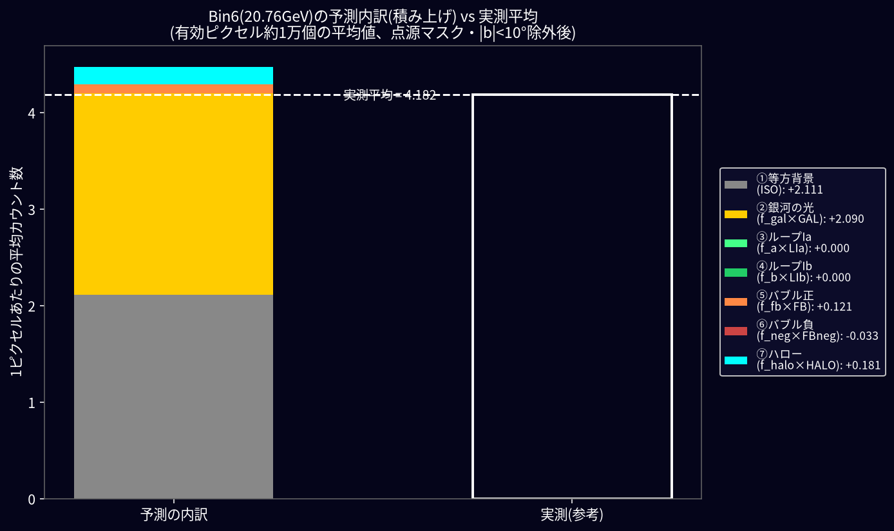
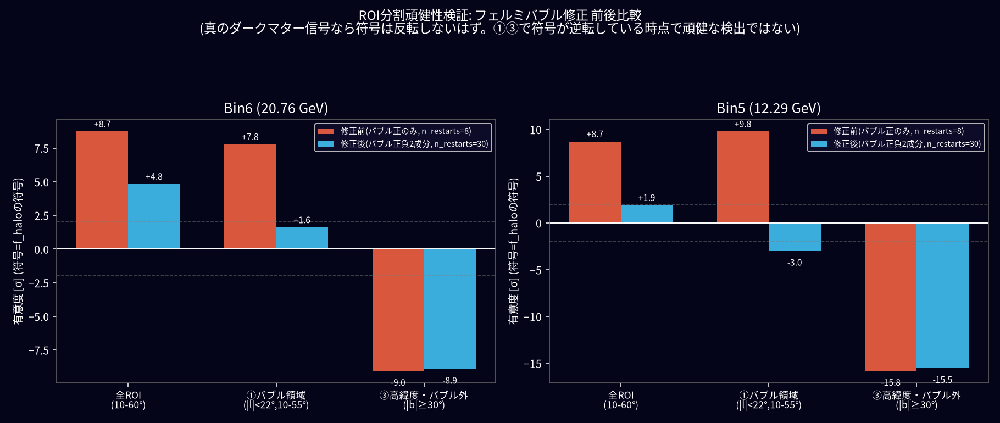
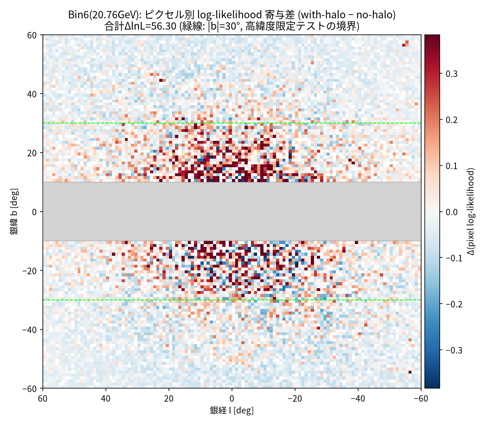
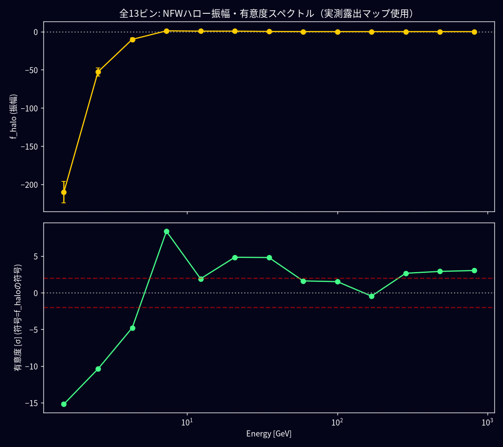

# MCMC解析の計算式検証(2026-07-13)

## 結論

計算式そのもの(単位・組み立て方)には問題なし。ただし**「ダークマターを検出した」と言える段階ではない**。原因の一部(フェルミバブルの実装不備)は特定・修正したが、残りの原因(銀河自身の光=GALPROPのモデル精度)は未解決。

---

## 1. そもそも何をしているか

Fermi-LAT衛星が観測したガンマ線(光の一種)を、天球を1°×1°のマス目(ピクセル)に区切って「そのマスに何個の光子が来たか」を数えます。これを**実測カウント数**と呼びます。

一方で、「もしダークマターが存在しなくても、そのマスには元々これくらいの光は来るはず」という**予測**を、知っている光源(宇宙背景・銀河自身の光・ループI・フェルミバブル)から組み立てます。これを`μ`(ミュー)と呼びます。

実測がこの予測より系統的に多ければ、「予測できていない何か(ダークマターかもしれない)がある」と言えます。

## 2. 予測`μ`はどうやって組み立てるか

例えると、「ある部屋の騒音レベル」を、知っている音源(外の交通音・換気扇・隅の人の話し声・テレビ)から予測するようなものです。ただし、それぞれの音源について「どれくらいの音量のはずか」という理論値はあっても、実際の音量とはズレることがあります(換気扇が思ったより静か/うるさい、等)。そこで、それぞれの音源の理論値に「実際の音量に合わせるための倍率」を掛けて、微調整します。

この「倍率」が `f_gal`, `f_halo` などの**つまみ**です。計算式は(`code/mcmc_fit_all_bins.py` の `make_mu()`, 201行目):

```
μ = ISO + f_gal×GAL + f_loopI_a×LIa + f_loopI_b×LIb + f_fb×FB + f_fb_neg×FBneg + f_halo×HALO
```

### なぜ「倍率」(f_◯)が必要なのか

例えば「銀河自身の光」(GAL)は、GALPROPという専用シミュレーションソフトで理論的に計算した明るさの地図です。しかしこれはあくまでシミュレーションによる**予想**であり、実際の銀河の明るさと寸分違わず一致する保証はありません。そこで「このシミュレーション結果を何倍すれば、実測データに一番よく合うか」を、コンピュータに探させます。

- もし `f_gal = 1.0` にぴったり近ければ → シミュレーションはほぼ正確だった、ということ
- 実際に得られた値は `f_gal ≈ 0.69` → シミュレーションが**予測しすぎていた**(実際の明るさは予測の69%しかなかった)、ということ

`f_halo`(ダークマター候補)だけは特別扱いで、マイナスの値も許可されています。理由は「本当は無いもの」を無理に探しているので、計算上「マイナス(=引きすぎ)」という結果もありうるからです。マイナスに出た場合は「ダークマターどころか、他の予測が明るさを見積もりすぎている」というサインになります。

### 実際の内訳(Bin6 = 20.76 GeV の場合)

言葉だけでなく、実際の数字でどれくらいの割合か見てみましょう。



1ピクセルあたり平均で光子4.18個が実測されているのに対し、予測の内訳はこうなっています:

| 順位 | 光源 | 平均カウント数 | 割合 |
|---|---|---|---|
| ① | 宇宙背景(ISO) | 2.111 | 約50% |
| ② | 銀河自身の光(f_gal×GAL) | 2.090 | 約50% |
| ③④ | ループI(2つ) | 0.0005 | ほぼ0% |
| ⑤ | フェルミバブル(正) | 0.121 | 約3% |
| ⑥ | フェルミバブル(負) | −0.033 | 約−1% |
| ⑦ | ダークマター候補(ハロー) | 0.181 | 約4% |

**「宇宙背景」と「銀河自身の光」の2つだけで、光の量のほぼ全部(約100%)を占めています。** ダークマター候補の取り分はわずか4%程度です。つまり、もし「銀河自身の光」の見積もりが数%レベルでズレていれば、それだけでダークマター候補の取り分(4%)を簡単に飲み込んでしまう、ということが、この図から直感的にわかります。これが、後述する「GALPROPのモデル精度が最大の問題」という結論の裏付けです。

各成分を実際にどう計算するか(数式)は1章の式の通りですが、「そもそもその地図の元ネタ(生データ)はどこから手に入れたのか」は次の3章で説明します。

単位もきちんと確認済みです(光子/cm²/秒/sr/MeV × cm²・秒 × sr × MeV = 光子の個数、と正しく打ち消し合う)。

---

## 3. 元ネタ(生データ)はどこから来たのか

「予測を計算する式」自体は2章で説明した通りですが、その式に入れる**材料そのもの**がどこから来たのかを、5成分それぞれについて説明します。

### ① 宇宙背景(ISO)

**外部から取得したデータではありません。** 今回使っている自分たちのFermi-LATイベントデータ(780週分)そのものの中から、天の川銀河から十分離れた場所(銀緯50°以上)のピクセルだけを見て、そこでの平均カウント数をそのまま「宇宙背景の明るさ」として使っています。つまり「NASAが公開している値」ではなく、**自分たちで測った値**です。

### ② 銀河自身の光(GAL, GALPROP)

Fermi-LATチーム(NASA/SLAC等の共同グループ)が公開している標準モデル`gll_iem_v07.fits`という1つのファイル(887MB)を使っています。これはGALPROPという銀河内の宇宙線伝播シミュレーションソフトの計算結果で、Fermi科学支援センター(FSSC)から誰でもダウンロードできます。Fermi-LATを使うほぼ全ての論文がこの標準モデル(またはその前身版)を使っており、業界標準品です(`ref/gll_iem_v07.fits`に保存)。

### ③ ループI(LIa, LIb)

これは「ダウンロードしてくる地図」ではなく、**論文に書かれた数値を使って自分で計算した幾何学的な形**です。Ackermann+2014(arXiv:1407.7905)・Ackermann+2017(arXiv:1704.03910)という2本の論文が報告している「2つの球殻(シェル)の位置・大きさ」の数値(位置・半径など計6個の数字×2シェル分)を使い、視線がその球殻を通る距離を自分たちで計算しています。この2論文自体は、Wolleben(2007年)の電波偏光サーベイ(実際の電波観測)がもとになっています。

### ④ フェルミバブル(FB, FBneg) — この章がユーザーの質問の核心

これも外部ファイルではなく、**自分たちが持っている同じFermi-LATイベントデータから作り出しています**。手順は:

1. 4.31 GeVのビンだけを取り出す
2. そのビンに対して、①宇宙背景・②銀河の光・既知の点源(4FGLカタログ)を、それぞれの標準的な引き算で除く
3. **それでも残った光(残差)** をそのままバブルの地図として採用する

つまり「フェルミバブルの地図」というのは、独立した観測データがあるわけではなく、「他の全部を引いた後に残る余り」を定義として使っています。これはTotani (2025)論文の3.1節に書かれている方法で、さらに元をたどるとFermi-LATチームがバブルを発見した際の論文(Su, Slatyer & Finkbeiner 2010等)で使われた手法の流れを汲んでいます。

### ⑤ ダークマターハロー(HALO)

これも観測データではなく、**理論モデル**です。NFWという、宇宙の構造形成シミュレーションでよく使われる標準的なダークマター密度分布の数式を使い、パラメータ(スケール半径 r_s=21kpc、密度 ρ_s=8.1×10⁶M☉/kpc³)は「Via Lactea II」という、天の川銀河サイズのダークマターハローを再現したN体シミュレーション論文の値をそのまま使っています。

### まとめ表

| 成分 | 元ネタの種類 | 具体的な出どころ |
|---|---|---|
| ①宇宙背景 | 自分たちのデータから測定 | 自前のFermi-LATイベントデータ(高緯度側の平均) |
| ②銀河の光 | 外部の公式モデル(ダウンロード) | Fermi-LATチーム公式 `gll_iem_v07.fits` |
| ③ループI | 論文の数値から自分で計算 | Ackermann+2014/2017論文(元は電波観測) |
| ④フェルミバブル | 自分たちのデータから作成 | 自前データの「引き算の余り」(Totani論文の手法) |
| ⑤ハロー | 理論モデル(自分で計算) | NFW数式 + Via Lactea IIシミュレーションの値 |

観測データそのものから作っている(①④)のと、外部の理論モデルを借りてきている(②③⑤)のとで、性質が違うことに注目してください。②(GALPROP)は「他人が作った理論モデル」なので、今回のように精度に疑いが持たれた際、モデルそのものを直接検証する手段が(Stanfordのサーバーが動いていない限り)手元にない、という弱点があります。

---

## 4. 「予測と実測、どれくらい合っているか」をどう測るか

サイコロを何度も振ると、出た目の合計は「期待値」の近くに集まりますよね。光子の数を数える観測も同じ統計法則(Poisson分布)に従います。ある1ピクセルで、予測が`μ`のときに実際に`n`個観測される確率は、

```
P(n|μ) = μⁿ × e^(−μ) / n!
```

という式(Poisson分布の教科書通りの式)で決まります。

### なぜ`ln`(自然対数)を使うのか

解析対象は約1万ピクセルあります。「全ピクセルまとめての当てはまり具合」を知りたいときは、本来は各ピクセルの確率 `P(n|μ)` を**全部掛け算**すればよいはずです。しかし、`P`は0〜1の間の小さい数なので、1万個も掛け算すると、答えは天文学的に小さい数(コンピュータの計算精度では実質ゼロ)になってしまい、扱えなくなります。

そこで、**掛け算の代わりに、対数をとって足し算にする**という、統計学で定番のテクニックを使います。対数には `ln(A×B) = ln(A) + ln(B)` という性質があるので、

```
ln(全ピクセルの確率の掛け算) = 各ピクセルの ln(P(n|μ)) の合計
```

に置き換えられます。掛け算より足し算の方が数値的に安定していて、コンピュータでの最適化計算(2章の「山登り法」)にも都合が良いのです。自然対数(底がe)を使うのは、Poisson分布の式に`e^(−μ)`という指数があり、`ln`はその逆演算にあたるため、式が一番シンプルになるからです(`ln(e^x)=x`)。

### 実際に数字で確認してみる

`P(n|μ)`の対数をとると、

```
ln P(n|μ) = n×ln(μ) − μ − ln(n!)
```

となります。このうち `ln(n!)` の項は `μ`(つまみの値)に関係ない定数なので、「どのつまみが一番良いか」を比べるときには影響せず、省略しても結果は変わりません。これが `code/mcmc_fit_all_bins.py` の `log_likelihood()`(220行目)で使われている

```
1ピクセルの当てはまり度 = n × ln(μ) − μ
```

という式の正体です。実際に数字を入れて検算してみましょう。2章の例(μ=4.18)で、あるピクセルの実測が n=5 だったとします。

- 素の確率: `P(5|4.18) = 4.18⁵ × e^(−4.18) / 5! ≈ 0.1627`
- 対数(定義通り): `ln(0.1627) ≈ −1.8159`
- 上の近似式: `5×ln(4.18) − 4.18 = 5×1.4303 − 4.18 = 7.1516 − 4.18 = 2.9716`
- 差は `ln(5!) = ln(120) ≈ 4.7875` なので、`2.9716 − 4.7875 = −1.8159` ✓ (Pythonで検算済み、完全一致)

ちゃんと一致します。これを全ピクセル分合計したものが、そのビン全体の「当てはまり度」`L` です。

### 「何σ」の出し方

2種類のモデルを用意して比較します。

- **ハロー無しモデル**: `f_halo=0` に固定して、残り5個のつまみだけ最良化 → 当てはまり度 `L_no`
- **ハロー有りモデル**: 6個全部を最良化 → 当てはまり度 `L_with`

この差 `ΔlnL = L_with − L_no` (ハロー成分を足したことでどれだけ説明力が上がったか)から、

```
有意度 σ = √(2 × ΔlnL)
```

という式(`fit_one_bin()`, 293行目)で、馴染みのある「何σ」に変換します。これは統計学の標準的な近似式(Wilksの定理)です。ただし、光子数が極端に少ないビンや、極端に大きい`σ`が出た場合はこの近似の精度自体が怪しくなる、という注意点があります(5章参照)。

### 「一番良いつまみの値」の探し方

6個のつまみの組み合わせは無限にあるので、コンピュータに「山登り法」(Nelder-Mead法)で探させます。ただし1回の山登りだと、途中の小さい丘(本当はもっと良い答えがあるのに、そこで止まってしまう場所)にはまることがあります。これを防ぐため、**出発点を30通り変えて、一番良かった結果を採用**しています(`_multistart_minimize()`, 234行目)。「なぜ30通りなのか」は5章③で説明します。

さらに、最良値だけでなく「その値がどれくらいの幅で確からしいか」もMCMC(`emcee`という標準的な手法、32人の探索者が1500回ずつ試行)で求めています。

---

## 5. 実際に何を検証して、何が見つかったか

### ① 場所ごとの頑健性チェック

全体を計算すると、Bin6で「8.73σ」というそこそこ自信のありそうな数字が出ました。しかし、**本物のダークマターなら、銀河中心に近くても遠くても符号(プラスマイナス)は変わらないはず**です。そこで解析範囲を「フェルミバブルのある領域」と「そこから離れた高緯度側」に分けて別々に計算し直しました。

結果、**符号が反転しました**(バブル領域内はプラス、高緯度側はマイナス)。全体の8.73σは、この2つの逆符号の誤差がたまたま打ち消し合ってできた見かけの数字だったとわかりました。

### ② フェルミバブルをTotani論文通りに修正

Totani (2025)論文の3.1節を読み直したところ、「バブル本体(正の残差)だけでなく、負の残差(銀河の光の見積もりミス由来と論文に明記)も、独立した別テンプレートとして使う」と書かれていました。旧実装は正の残差しか使っておらず、この「負のテンプレート」(3章④)を丸ごと欠いていました。

修正して計算し直した結果:



**バブル領域内の見かけの超過は、この修正でほぼ消えました**(Bin6: +7.8σ→+1.6σ)。一方、高緯度側のマイナスは変わっていません(バブルのテンプレートはその領域では元々ゼロだから当然)。これは別の原因(GALPROP)が疑われることを意味します。



*上図: 「ハロー有りモデル」が「ハロー無しモデル」よりどれだけ当てはまりが良くなったかを場所ごとに色分けした地図。改善(赤色)は銀河中心付近(|b|=10〜30°)に集中しており、天球全体に薄く広がるダークマターの光、という想定とは違う分布をしています。*

### ③ 計算アルゴリズムが正しく収束しているかの再確認

②でつまみが5個→6個に増えたところ、一部のビンで不自然に高い有意度(25〜27σ)が出ました。前述の「出発点の数」を8→30→60と増やして確認したところ、8回では答えが安定しておらず(Bin3で29.4σ→20.6σ→4.68σと変化し続けた)、**30回で初めて安定する**ことが分かりました。これはコードの計算式自体の間違いではなく、「答えを探す試行回数が足りなかった」という数値計算上の問題でした。30回に修正し、全ビンを計算し直しています。

### ④ 手元にあったGALPROPの代替データは使えるか

「銀河自身の光」を、ガス由来と宇宙線由来の2種類に正しく分けて計算し直せば、③の高緯度側のマイナスが解消するのではと考え、過去に取得していたGALPROP専用計算(webrun)データを試しました。

結果、①②③で直した最新の計算方法を使っても、**全13ビンで有意度37.9σ〜63.6σという明らかにおかしい数字**が出ました(Bin6で必要な「銀河の光の明るさ」つまみが、通常0.69であるべきところ0.0000000032という、あり得ない値になっていた)。

このデータのファイルを確認したところ、ガスの温度設定が125K(Totani論文の指定は150K)、ファイル内の「タイトル」欄が「Untitled WebRun calculation」(=無題の計算)となっており、**Totani論文の設定とは違う、別の(おそらく試験用の)データ**だったと確定しました。計算方法(式)側の問題ではないと確認できたので、正しいデータさえ手に入れば、この部分は検証できる見込みです。

---

## 6. 最終結果(全13エネルギー帯)



| E[GeV] | 1.51 | 2.55 | 4.31 | 7.28 | 12.29 | **20.76** | 35.06 | 59.22 | 100.02 | 168.93 | 285.33 | 481.93 | 814.00 |
|---|---|---|---|---|---|---|---|---|---|---|---|---|---|
| 有意度[σ] | −15.2 | −10.4 | −4.8※ | +8.4※ | +1.9 | **+4.8** | +4.8 | +1.6 | +1.5 | −0.5 | +2.7 | +2.9 | +3.0 |

※4.31/7.28GeVはフェルミバブルのテンプレートを作った基準ビンの近く(4.31GeV自身とその隣)なので、テンプレート自体がそのビンの実データに近すぎて人工的に高く/低く出やすく、解釈には注意が必要です(Totani論文も同様の注意を明記)。

低エネルギー側の強いマイナスは、「銀河自身の光」を引きすぎていること(GALPROPモデルの不正確さ)の現れと推定されます。本命の20.76GeVの+4.8σも、5章①②で説明した通り場所によって符号が変わるため、頑健な検出とは言えません。

## 7. まだ残っている課題

1. GALPROPを「ガス由来」「宇宙線由来」の2種類に正しく分けて計算し直す → Stanfordの計算サーバー(`galprop.stanford.edu`)の復旧待ち。手元の代替データは使えないと確定済み(5章④)
2. フェルミバブルの境界線(現状は固定の四角形)を、Totaniのように繰り返し調整して精緻化する余地がある
3. 有意度の近似式(√(2ΔlnL))自体が、光子数が極端に少ない/多いビンでどこまで正確かは未検証

矮小銀河5天体の解析はこの問題と独立の解析パイプラインで行っており、全て「非検出」という結果に変わりありません。
